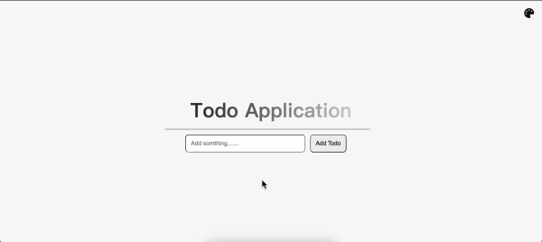

# 📝 Todo List

這是一個使用 React 製作的 Todo List 專案，具備基本的任務管理功能，並搭配動畫與錯誤提示提升使用者體驗。

## 🔧 技術

- React (Hooks)
- SCSS
- FontAwesome Icons

---

## 專案預覽



[▶️ 點我看完整的展示影片](https://youtu.be/ybsd0ue6HcE)

## 📌 功能介紹

### ✅ Todo 管理功能

- **新增任務**：透過輸入框輸入後按下 `Enter` 或點擊按鈕即可新增。
- **刪除任務**：點擊刪除圖示，卡片會執行滑出動畫後刪除。
- **標記完成**：任務打勾後會有刪除線與淡出樣式。
- **編輯任務**：點選編輯後可直接修改文字，並使用 `Enter` 儲存。
- **錯誤提示**：防止儲存空內容，並顯示紅框閃爍提示。

- **重設狀態**：若使用者將已完成的任務重新編輯，系統會自動將其重設為未完成狀態，以避免混淆。


### 🎨 顏色與主題切換

- 點擊右上角調色盤按鈕切換「淺色 / 深色模式」
- 所有 UI 元件支援同步主題變換（按鈕、文字、背景等）

### 💫 動畫效果

- 卡片刪除滑出動畫
- 編輯錯誤閃爍紅框提示
- 選單彈出時分段淡入動畫

## 📂 專案結構

```
Todo-List/
├── public/
├── src/
│   ├── App.jsx
│   ├── App.scss
│   └── ...
├── package.json
└── README.md
```

---

## 📦 安裝與執行方式

```bash
git clone https://github.com/your-username/todo-list.git
cd Todo-list
npm install
npm start
```

---

## 🛠 開發者筆記

- 此專案聚焦於練習前端應用的 CRUD（Create, Read, Update, Delete）邏輯實作與使用者互動
- 使用 `useRef` 管理編輯輸入框焦點與 Todo 唯一 ID
- 使用 `setTimeout` + `useEffect` 避免錯誤提示永久存在
- 所有動畫透過 SCSS `@keyframes` 控制，搭配 class 切換達成
- 所有狀態切換皆符合 React 單向資料流與最佳實踐

---

## 📃 License

此專案僅用於個人學習與展示，無商業用途。

---

## 🙌 作者

Created by **Lee Jay 張立杰**  
轉職中前端工程師 🧑‍💻
